# What is `Memento`?
- `Memento` is a custom UO shard that focuses on an immersive experience for a Single Player or Small Group
- `Memento` offers an **Opinionated** interpretation of the amazing `Ruins and Riches` (R&R) server
  - We have focused on defining a power curve so Players are given opportunities to enjoy the journey
  - Some pre-requisites have been added to make it more about the journey than the destination

# What are some features `Memento` added?

  
Achievement system

  ## Notifications and log, from Mythik
  - Players now keep a historical record and receive hints in a targeted fashion

  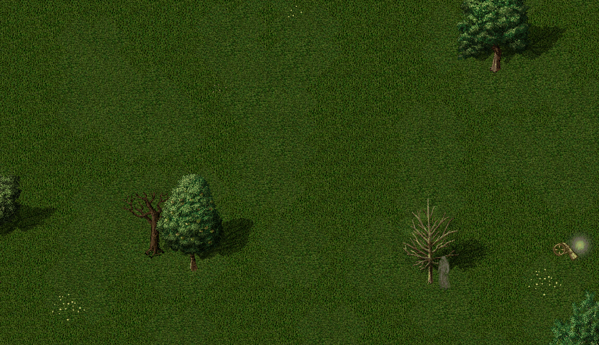

  
Challenging Content

  ## Champion Spawns
  - Initiated by a random hard-mob item drop
  - Challenge yourself and your comrades by increasing difficulty
    - Rewards are based on your chosen configuration
    - Adjust spawn size (impacts spawns running around & required kills per level)
    - Adjust monster difficulty (impacts health/skills/damage)

  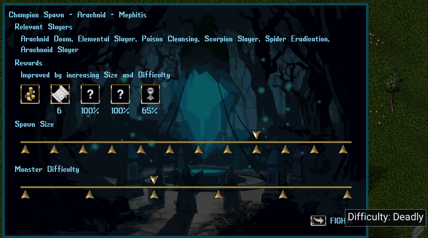

  
Citizens changes

  ## Citizens have been updated to track if they've recently been spoken to

  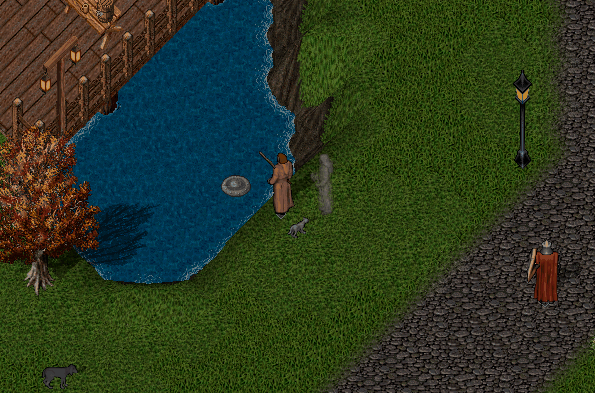

  
Crafting changes

  ## Bulk Crafting
  - Single crafting functions the same
  - Bulk crafting occurs when you specify a *Craft Amount* > 1
  - Displays results based on *Fail* / *Success* / *Exceptional* status
  - You can *Pause* and *Resume* Sessions
  - Sessions end when pressing *Stop*, if the tool breaks, or if the specified number of attempts were made
  - Removes the need to write scripts to raise crafting skills

  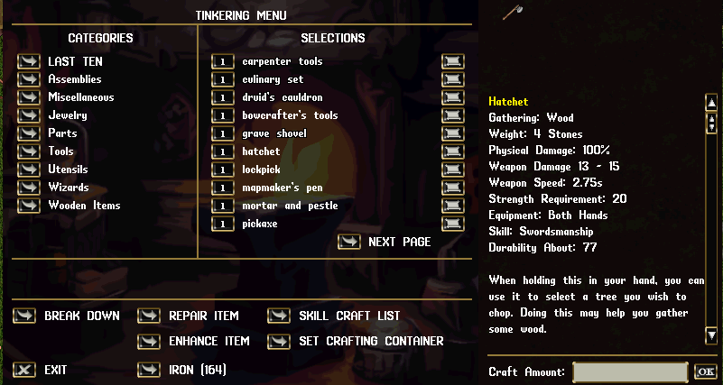

  ## Bulk Salvage/Break Down
  - Gone are the days of individually targeting items to Break Down (Salvage)

  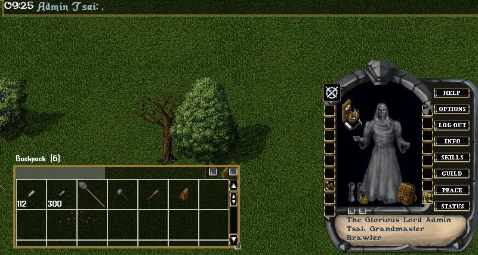

  ## Shoppes
  - Shoppes are no longer hidden away in your house
  - Shoppes are now bound to your Account rather than your Player
  - Refactored gump to make it more legible
  - Added Orders, which are similar to small Bulk Order Deeds

  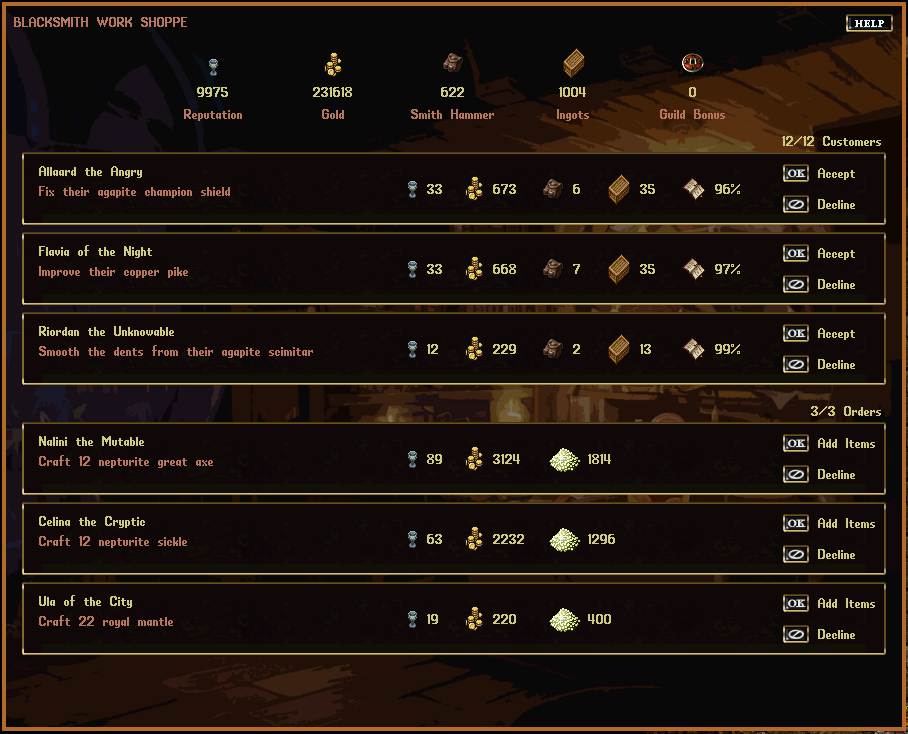
  
  ## Skill Craft List
  - Accessible via the Crafting gump
  - Only shows items that you can still get gains from, based on your current skill value

  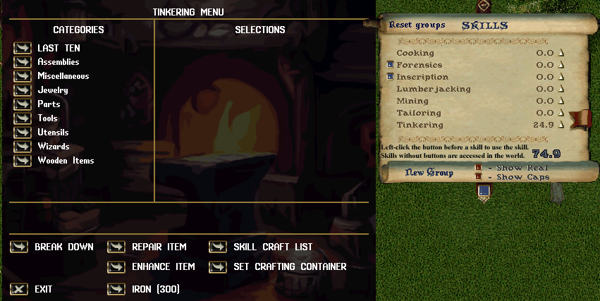

  
Gathering changes

  ## Easier harvesting
  - After targeting a Node, a Player will continue harvesting it until it is empty
  - Removes unnecessary clicking/targeting spam
  - Clearer for new players

  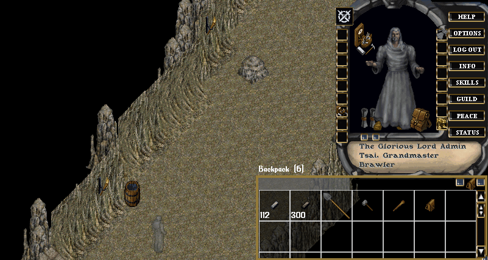

  ## Glistening Ore Veins
  - Enhancement to the Mining system
  - Rich deposits of ore will randomly spawn around the world
  - These deposits are always *Dull Copper and higher*
  - Promotes active gameplay

  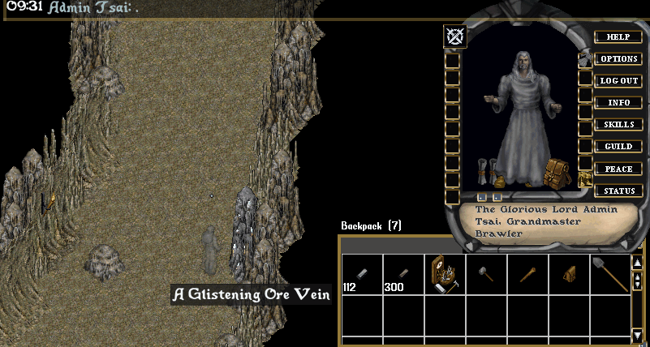

  ## Rich Trees
  - Enhancement to the Lumberjacking system
  - After fully harvesting a tree, you may notice a Rich Tree nearby
  - These deposits are always Ash and higher
  - Promotes active gameplay

  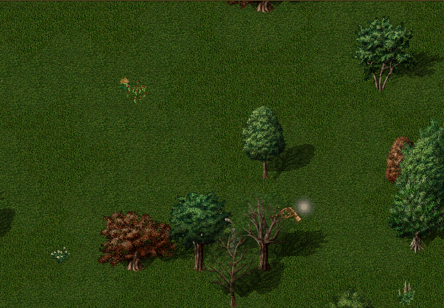

  
Item changes

  ## Overall power
  - Items have much fewer magical attributes, allowing for reduced mental load
  - Artifacts no longer have enchantment points
  - Only items made of basic resources may be enhanced with other resources
  - Resources bonuses have been refined to provide incremental increases in power

  ## Skinning Knife
  - Skinning knives are now Tools instead of Weapons
  - They may still be used from the backpack to carve things
  - When equipped as a Trinket, they will automatically skin corpses

  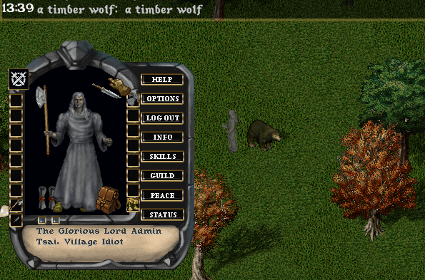

  ## Swapping hand-slots improved
  - Double-clicking items that require your hands will automatically place them in your hands.
  - Common uses:
    - Putting on a crafting tool for use
    - Putting on a gathering tool for use
    - Slayer weapon swapping
    - Throwing on a Shield or Bow

  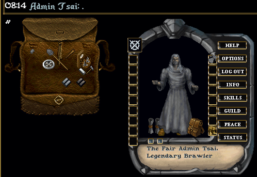

  
Quest changes

  ## New Quest System, from RunUO
  - New quests are written against this system
  - Quest objectives are easily readable
  - Early quests provide key tips
  - Quest details are accessible at any time via *View Quest Log*
  - Modular design allows for the community to share their own quests

  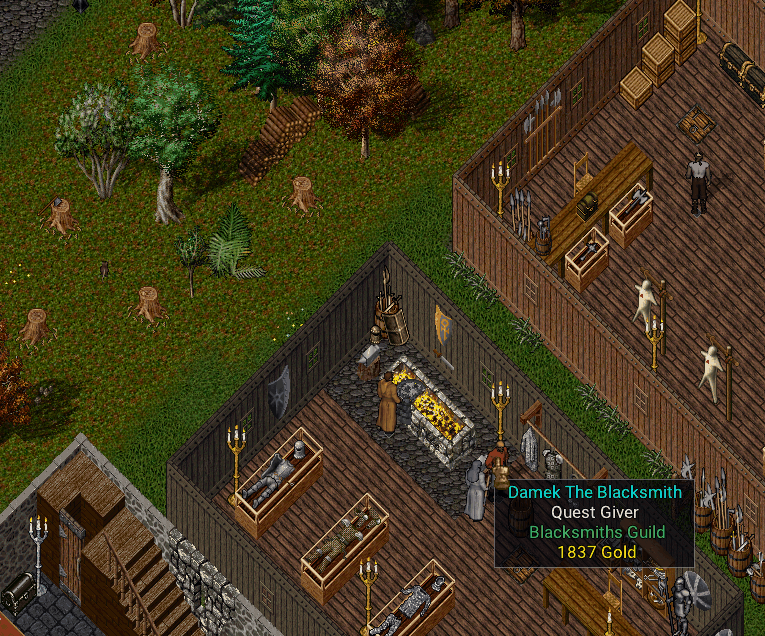
  

  
Runebook changes

  ## Streamlined flow
	Left Page:
	- First button is for "selecting the rune" (updates Right page)
	- Second button is for using the "default spell" on that rune (Players will use this 95% of the time)

	Right Page:
	- Spell list is now automatically filtered
	- Spell list shows a different color text for the "default spell" you have configured on the Book
	- Can now rename the rune from within the book
	- Can now up/down the rune (instead of having to re-insert them in a specific order)

  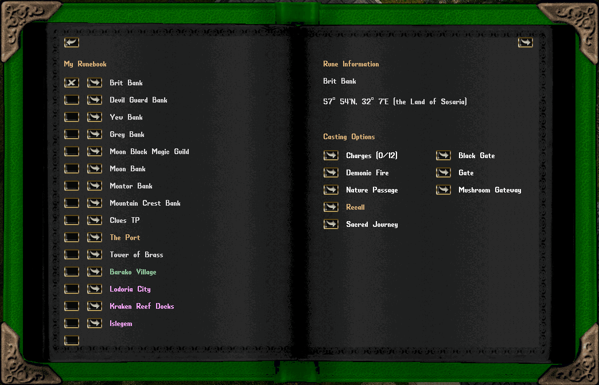
  

  
Skill changes

  ## Gain rates
  - Most skills can get to the 60-70 skill range within an hour of gameplay
  - After 70, Skill gain rates begin to slow down so they continue to provide a feeling of progress

  ## Secondary Skills
  - Secondary Skills are skills that do not affect your Player's total skill cap
  - All Crafting and Gathering skills are considered a Secondary Skill
  - Secondary Skill values are filtered out when clicking the `Show Real` gem

  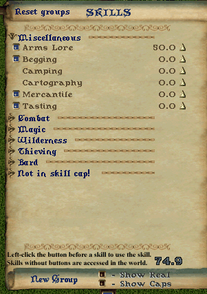

  ## Healing
  - Performs multiple success checks per session
  - Executes multiple skill checks per session

  ## Spiritualism
  - Consuming a corpse now restores Mana
  - Notably more useful during early game
  - A nice alternative to the standard Wraith Form based caster

  ## Taming
  - Added Jako's pet leveling and trait system
  - Leveling pets will execute skill checks, giving the opporunity for gains (thanks, Ultima Adventures)
  

  
Vendor changes

  ## Vendors naturally restock
  - Vendors have limited gold (thanks, Adventurers of Akalabeth)
  - If hovering over them hover tip will say `? Gold`, the amount will be generated as soon as you trigger Buy/Sell gump
  - Vendors will vocalize when they have regenerated their available gold

  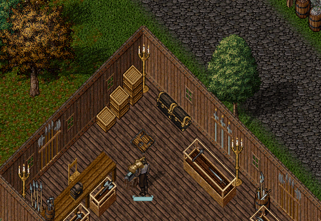

  ## Vendors sell useful equipment
  - The equipment that vendors sell will become increasingly *more magical* as your Fame and Karma increase

  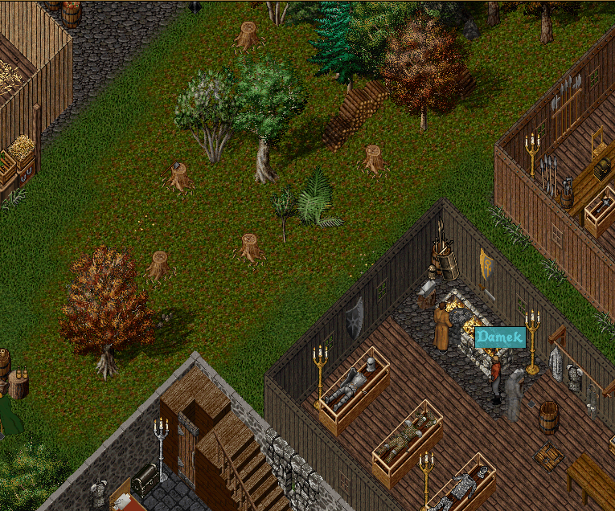

  ## VendorGold command
  - Vendors have a safeguard that will stop a sale if you are selling them items that are worth more than they have
  - This command allows Players to individually toggle that safeguard

  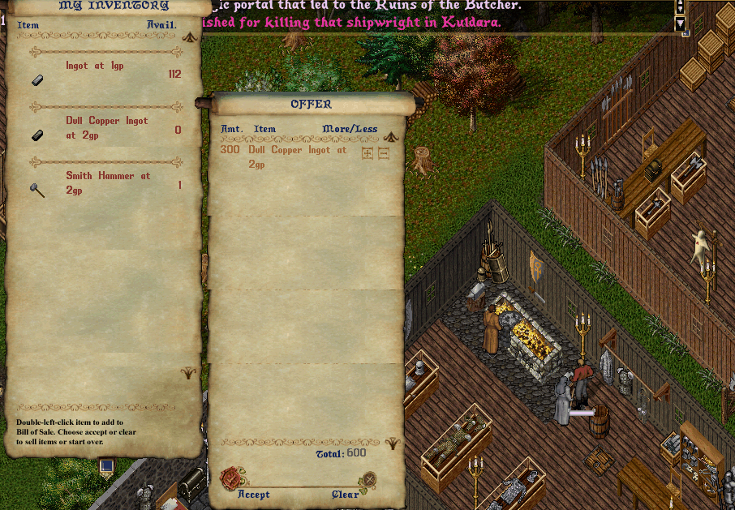
  

# Running locally
Compile the World.exe:
- Navigate to `World\Source\Tools`
- Execute `compile-world-win.bat`
- Execute `World\World.exe`